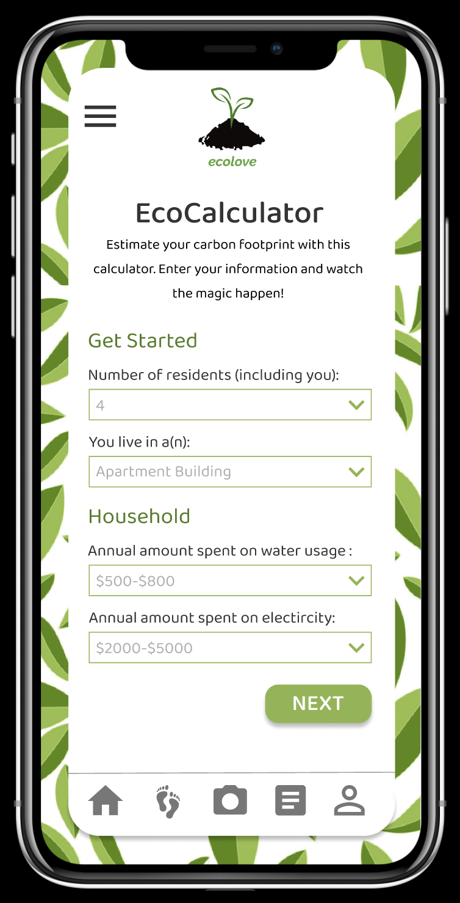
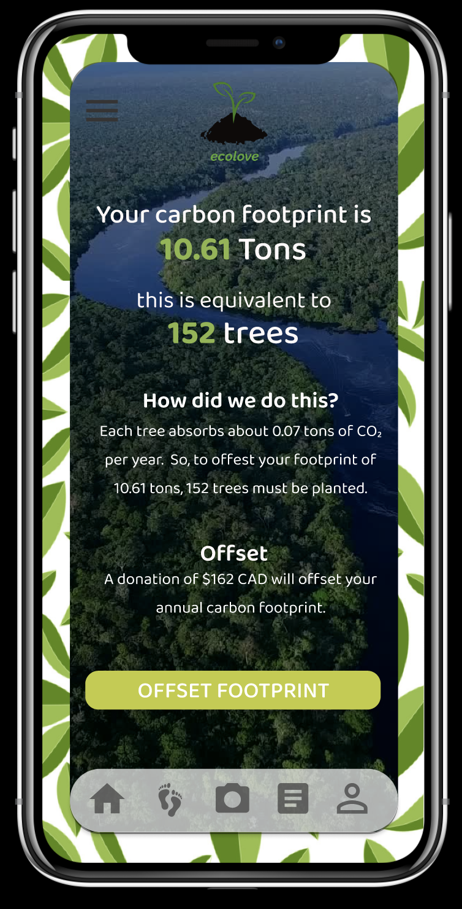
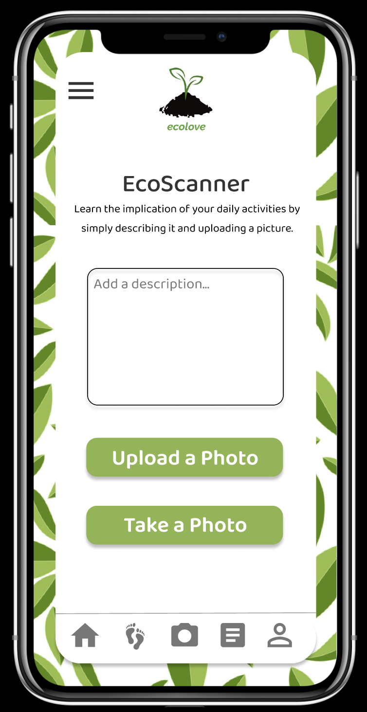
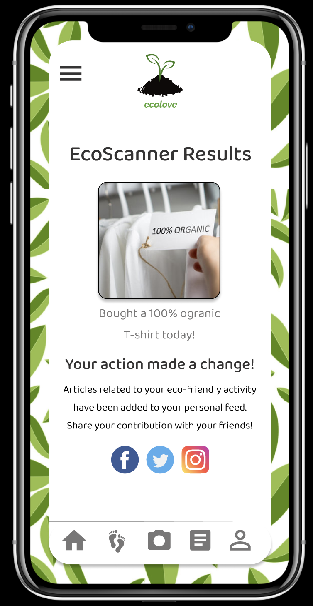
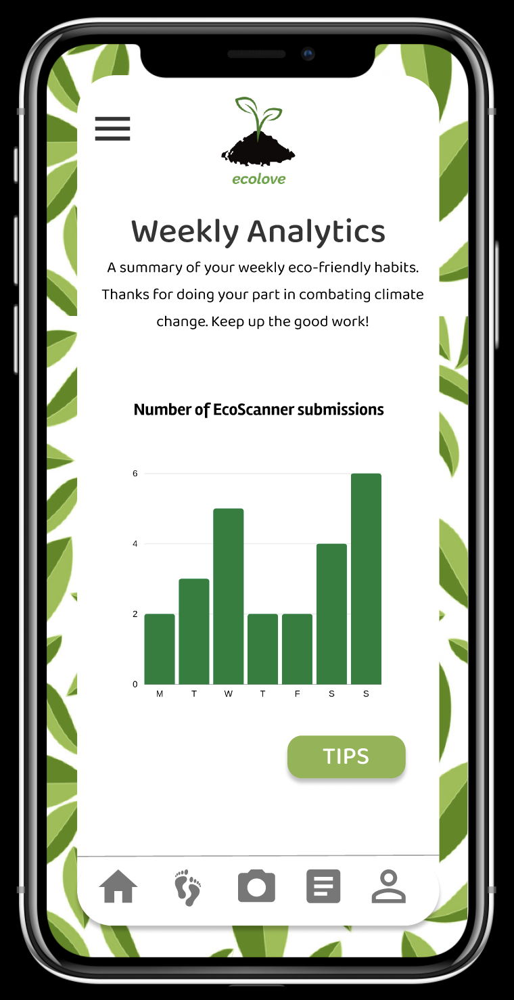
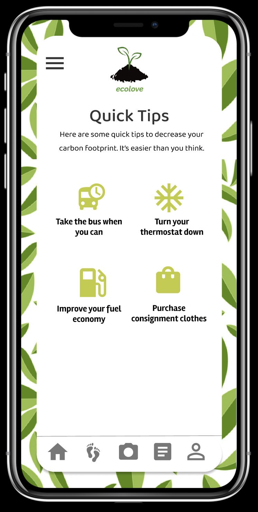

  

<h1 align="center"><EcoLove App and Website</h1>
EcoLove App and Website
  
## Introduction
Project created for [ElleHacks 2021 Hackathon](https://ellehacks.com/), with the aim to combat climate change. An all-in-one guide to help people life a more eco-friendly lifestyle. Watch our pitch video [here](https://youtu.be/LhR2N6H4atM) and navigate thought our immersive prototype app [here](https://www.figma.com/proto/twGLcpGeYjX4NoNTNPDTAJ/EcoLove?node-id=5%3A8&scaling=scale-down).

## Features
<h4 align="left"><Carbon footprint calculator</h4> Carbon footprint calculator

  
   

<h4 align="left"><Ecoscanner</h4>Eco-scanner

  
   

<h4 align="left"><Weekly Summary and tips</h4>Weekly Summary and tips

  
   

  
<h4 align="left"><Personalized news feed</h4>Personalized news feed

  

## Screenshots
<h4 align="left"><Home screen</h4>Home screen

  

<h4 align="left"><About us</h4>About us

  

<h4 align="left"><Edit profile</h4>Edit profile

  

